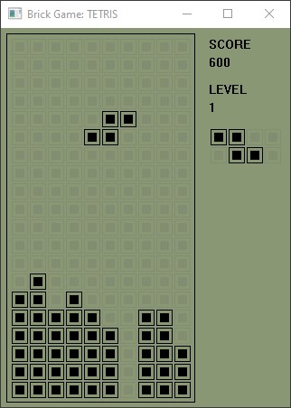

# Brick Game Tetris - Juego clásico hecho con C++

Juego realizado con **Miniwin**, una pequeña libreria gráfica **para windows**.

## Características

- Control mediante las teclas direccionales.
- Es posible acelerar la caida de la pieza.
- El nivel del juego aumenta a medida que se suman puntos.
- La velocidad de caida de piezas aumenta en cada nivel.
- Se muestra las distintas estadísticas de la partida.
- Se visualiza en pantalla la siguiente pieza que caerá
- Apariencia inspirada en el clásico "Brick Game"

## Instalación

Después de descargar o clonar el repositorio, se debe compilar el código con GPP. 

#### Usando Makefile
Para usar este método, además de GPP, debe estar disponible la herramienta "Make". Todos los comandos necesarios serán ejecutados de forma automática.
```bash
make tetris
```
#### Compilar manualmente
Comandos necesarios para compilar manualmente el proyecto:
```bash
mkdir -p ./obj
g++ -I./include -Wall -g -c ./src/main.cpp -o ./obj/main.o
g++ -I./include -Wall -g -c ./src/miniwin.cpp -o ./obj/miniwin.o
g++ -I./include -Wall -g -o tetris ./obj/main.o ./obj/miniwin.o -lgdi32 -mwindows
```

## Preview




## Creditos

- [Documentación de Miniwin](https://miniwin.readthedocs.io/en/latest/index.html)
- [Repositorio de Miniwin](https://github.com/pauek/MiniWin)
